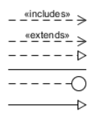
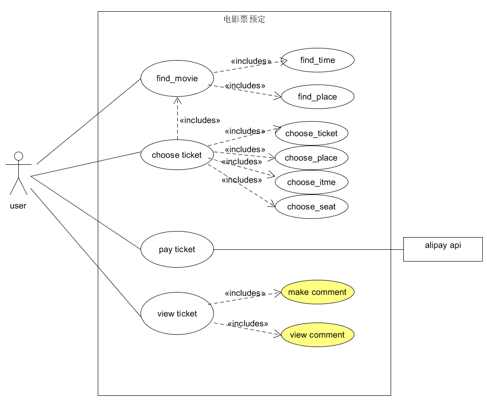
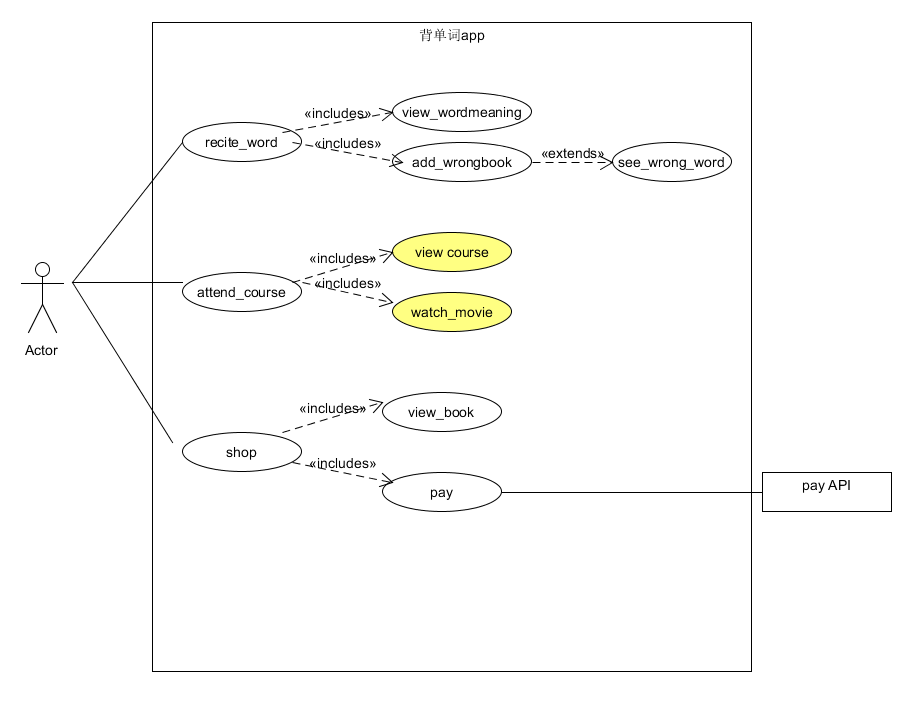

## 第四次作业

{:.no_toc}

[TOC]

## 用例的概念

------

是软件工程或系统工程中对系统如何反应外界请求的描述

## 用例和场景的关系？什么是主场景或 happy path？

------

- 每一个用例包括了许多个场景

- 每一个用例中都包含一个主场景
- Happy path在测试用例中指没有出现预期之外结果的场景，在用例建模中指主成功场景中，主执行者完成了目标，所有相关人员的需求都被满足了。

## 用例有哪些形式？

------

- 简要格式（Brief）：简短的一段总结，通常是主要的成功场景。在早期的需求分析中，为了快速了解主题和范围，可能只需要几分钟就可以创建。
- 简便格式（Casual）：非正式段落格式。涵盖各种场景的多个段落。
- 完整正式的格式（Fully）：详细描述了所有步骤和变化，并有支持部分，如先决条件和成功保证
- 双列表格式
- 单列表格式
- RUP格式

## 对于复杂业务，为什么编制完整用例非常难？

------

复杂业务的actors和services多且复杂，因而编制完整用例非常难

## 什么是用例图？

------

用例图是指由参与者（Actor）、用例（Use Case），边界以及它们之间的关系构成的用于描述系统功能的视图。用例图（User Case）是外部用户（被称为参与者）所能观察到的系统功能的模型图。

## 用例图的基本符号与元素？

------

- 参与者不是特指人，是指系统以外的，在使用系统或与系统交互中所扮演的角色。  
- 
- 用例是对包括变量在内的一组动作序列的描述，系统执行这些动作，并产生传递特定参与者的价值的可观察结果。
- 
- 系统边界是用来表示正在建模系统的边界。
- 
- 箭头用来表示参与者和系统通过相互发送信号或消息进行交互的关联关系。
- 

## 用例图的画法与步骤

------

- 确定研讨的系统
- 识别Actors
- 识别用例
- 建立Actor和Use Cases之间的关联

## 用例图给利益相关人与开发者的价值有哪些？

------

- 明确系统的业务范围、服务对象（角色）、外部系统与设备
- 帮助识别技术风险，提前实施关键技术原型公关与学习
- 易于评估项目工作量，合理规划迭代周期，规划人力需要

## 建模练习题

------

选择2-3个你熟悉的类似业务的在线服务系统（或移动 APP），如定旅馆（携程、去哪儿等）、定电影票、背单词APP等，分别绘制它们用例图。并满足以下要求：

- 请使用用户的视角，描述用户目标或系统提供的服务
- 粒度达到子用例级别，并用 include 和 exclude 关联它们
- 请用色彩标注出你认为创新（区别于竞争对手的）用例或子用例
- 尽可能识别外部系统和服务
- 然后，回答下列问题：
  1. 为什么相似系统的用例图是相似的？
  2. 如果是定旅馆业务，请对比 Asg_RH 用例图，简述如何利用不同时代、不同地区产品的用例图，展现、突出创新业务和技术
  3. 如何利用用例图定位创新思路（业务创新、或技术创新、或商业模式创新）在系统中的作用
  4. 请使用 SCRUM 方法，选择一个用例图，编制某定旅馆开发的需求（backlog）开发计划表
  5. 根据任务4，参考使用用例点估算软件成本，给出项目用例点的估算

   

- 1. 相似的系统的参与者，用例等都是相似的，同时用户的需求也相似，所以用例图也相似。
  2. 不是定旅馆业务，但是我认为，在不同地区，用户习惯会不一样，要因地制宜，展现独特的创新之处。
  3. 看创新点在用例图的位置，如果是用户级别的用例，其作用就比较大。作用等级逐级递减。
  4. 

  | ID   | Name          | Imp  | Est  | How to demo                                  |
  | ---- | ------------- | ---- | ---- | -------------------------------------------- |
  | 1    | find_time     | 3    | 4    | 点击电影，提示电影上映的时间                 |
  | 2    | find_place    | 3    | 4    | 点击电影，提示电影上映的影院                 |
  | 3    | choose ticket | 5    | 7    | 进入电影选择界面，选择电影，座位，影院，时间 |
  | 4    | pay ticket    | 4    | 7    | 支付系统，使用api                            |
  | 5    | make comment  | 1    | 3    | 看完电影后可以对电影进行评论                 |
  | 6    | view comment  | 2    | 2    | 可以查看某部电影的评论                       |

  ​5. 

  | 用例           | # 事务 | # 计算 | 原因 | UC 权重 |
  | -------------- | ------ | ------ | ---- | ------- |
  | 1find_time     | 3      | 3      |      | 简单    |
  | 2find_place    | 3      | 2      |      | 简单    |
  | 3choose ticket | 6      | 8      |      | 困难    |
  | 4pay ticket    | 4      | 5      | 框架 | 平均    |
  | 5make comment  | 3      | 3      |      | 简单    |
  | 6view comment  | 3      | 3      |      | 简单    |

