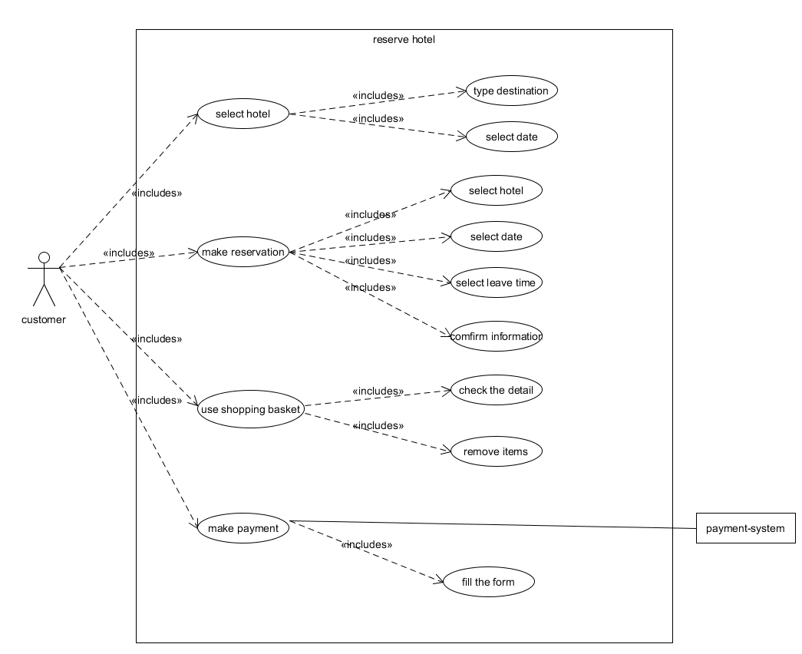
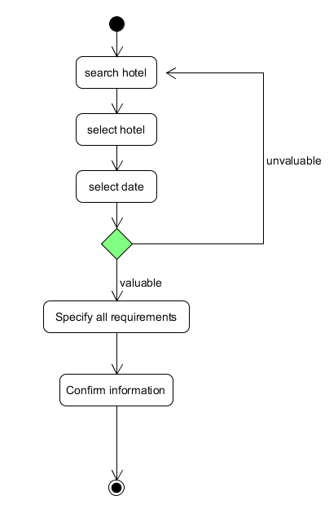
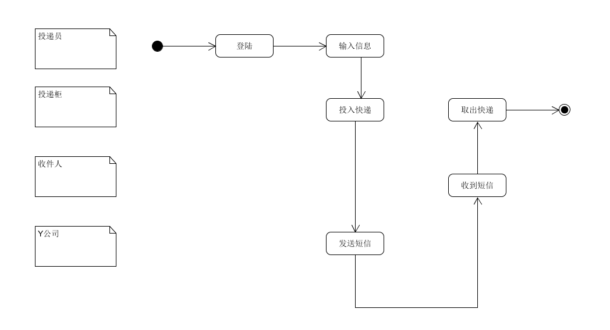
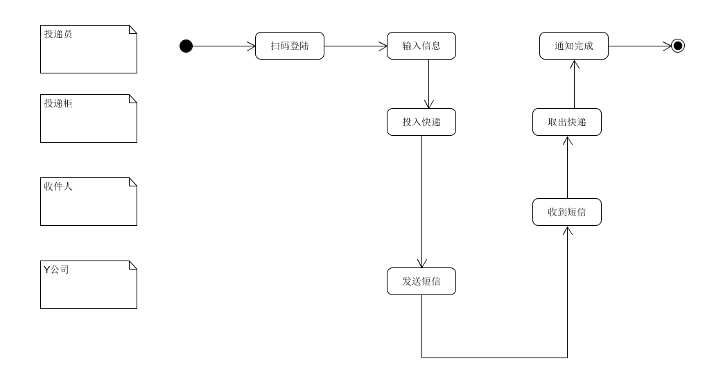
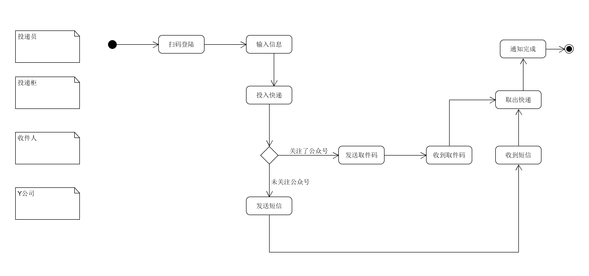
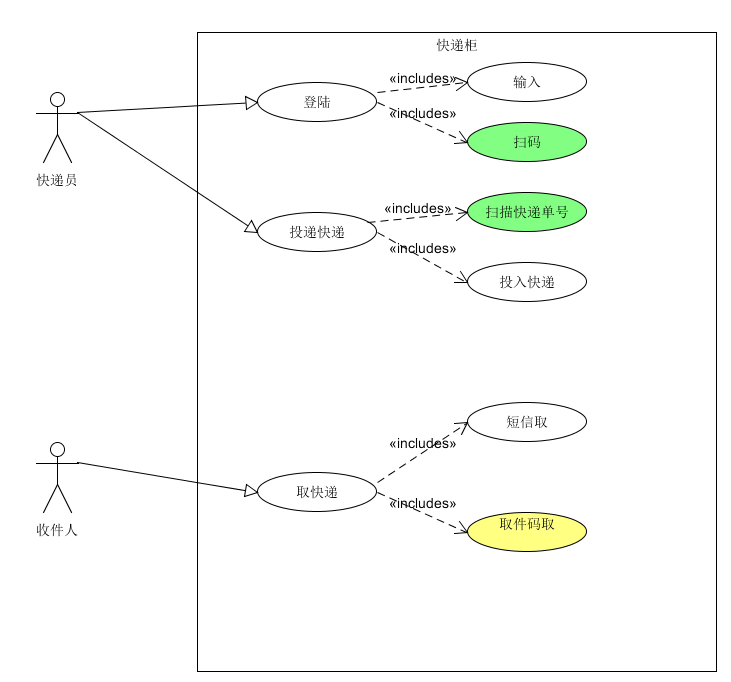

## 第五次作业

{:.no_toc}

* 目录
{:toc}

### 根据订旅馆建模文档，绘制用例图模型（到子用例）

---

  

### 给出 make reservation 用例的活动图

---

  

### 分别用多泳道图建模三个场景的业务过程

---

    

    

    

### 根据上述流程，给出快递柜系统最终的用例图模型

---

   

