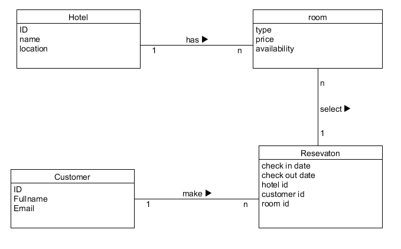
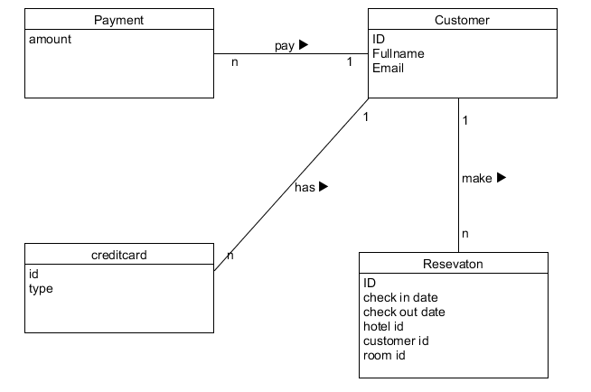
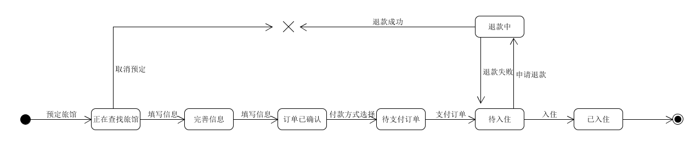

### 1、使用类图，分别对 Asg_RH 文档中 Make Reservation 用例以及 Payment 用例开展领域建模。然后，根据上述模型，给出建议的数据表以及主要字段，特别是主键和外键

---

#### Make Reservation领域建模

- Customer(ID/Key,Fullname,Email) 

- Reservation(ID/Key,CustomerID/Fkey,HotelID/Fkey,RoomID/Fkey,CheckInDate,CheckOutDate) 

- Room(ID/Key,Availability,Price,Type)   

- Hotel(ID/Key,Name,location)   

#### Payment领域建模

- Customer(ID/Key,FullName,Email)

- Reservation(ID/Key,CustomerID/Fkey,HotelID/Fkey,RoomID/Fkey,CheckInDate,CheckOutDate) 

- Payment(ID/Key,amount)

- CreditCard(ID/Key,Type)

  

  

## 使用 UML State Model，对每个订单对象生命周期建模

---

主要状态：

- 正在查找旅馆
- 完善信息
- 订单已确认

- 待支付订单
- 待入住
- 退款中
- 已入住

常见事件：

- 预定旅馆

- 填写信息

- 取消预定

- 付款方式选择

- 支付订单

- 申请退款

- 退款失败

- 退款成功

- 入住

  

